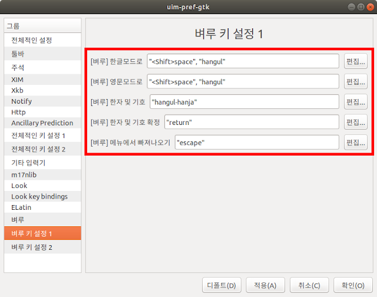

# Ubuntu에 한글 설치 하기

1. uim 패키지 설치

    ```jsx
    $ sudo apt install uim
    ```

    *패키지 삭제

    ```jsx
    $ sudo apt remove uim
    $ sudo apt autoremove
    ```

2. 기본 입력기를 IBus 대신 uim으로 변경

    설정 → 지역 및 언어 → 입력소스는 영어(미국)만 등록

3. uim 설정

    바탕화면 → 언어 지원 →키보드 입력기 "uim" 으로 변경

4. 입력기 설정

    바탕화면 → 입력기 → 전체적인 설정 → 디폴트 입력기 "벼루" →사용되는 입력기 "벼루"만 등록

    툴바 → display "Never"

5. 전체적인 키 설정 1

    전체 on, 전체 off →전부 지우기

6. 벼루 키 설정 1

7. 

    

8. 기본 키 맵핑

```bash
// 오른쪽 Alt키의 기본 키 맵핑을 제거하고 'Hangul'키로 맵핑
$ xmodmap -e 'remove mod1 = Alt_R'
$ xmodmap -e 'keycode 108 = Hangul'

// 오른쪽 Ctrl키의 기본 키 맵핑을 제거하고 'Hangul_Hanja'키로 맵핑
$ xmodmap -e 'remove control = Control_R'
$ xmodmap -e 'keycode 105 = Hangul_Hanja'

// 키 맵핑 저장
$ xmodmap -pke > ~/.Xmodmap
```